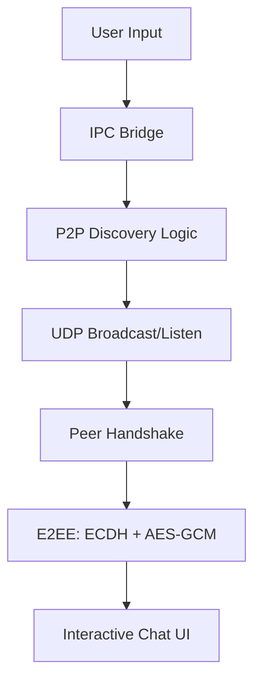

# 🔗 Lost-Link: Secure Offline LAN Chat
## Professional Decentralized Communication for Local Networks


> [!NOTE]
> **Project Goal**: A high-performance, production-ready offline messaging application designed for zero-configuration peer-to-peer communication. Optimized for privacy and speed, ensuring your data never leaves your local network.

---

## 🎯 Project Overview

### Purpose
Create a secure communication bridge for environments where internet access is unavailable or privacy is critical:
- ✅ **Serverless Discovery**: Uses UDP broadcasting to find peers automatically.
- ✅ **True Privacy**: End-to-end encryption (E2EE) ensures only recipients can read messages.
- ✅ **Offline First**: Operates 100% locally on any LAN setup.
- ✅ **Modern UI**: Built with a sleek React & Tailwind CSS dashboard.
- ✅ **Zero Config**: No complex setup; just launch and chat.

### Key Features
| Feature | Description |
|---------|-------------|
| **📡 Peer-Discovery** | Automatic detection of active users on your subnet via UDP |
| **🔒 E2EE Security** | ECDH key exchange + AES-GCM encryption for every message |
| **⚡ Real-time Sync** | Instant message delivery with React-based state management |
| **🛡️ Local-Only** | Absolute data residency; no cloud or external logging |
| **📂 IPC Bridge** | Robust Electron-Vite main/renderer communication pipeline |
| **🎨 Premium UI** | Dynamic dark-mode design with smooth micro-animations |

---

## � Repository Structure

```
lost-link/
├── 📁 src/                        # Core application source
│   ├── 📁 main/                  # Electron main process (P2P logic, UDP)
│   ├── 📁 preload/               # Secure IPC bridge layer
│   └── 📁 renderer/              # React frontend (UI & Components)
├── 📁 resources/                  # App icons and static assets
├── 📁 legacy_src/                 # Retained prototype scripts (reference)
├── 📁 out/                        # Compiled production build
└── electron-builder.yml           # Packaging & Distribution config
```

---

## 🚀 Quick Start

**Lost-Link** is built with `electron-vite` for a seamless development and build experience.

### 💻 1. Installation (macOS / Linux / Windows)
Open your terminal and run:

```bash
# Clone the repository
git clone https://github.com/NotShubham111/Lost-Link.git

# Navigate to the project folder
cd lost-link

# Install dependencies
npm install

# Start development mode
npm run dev
```

---

### 📦 2. Building for Production
To package the app for your specific operating system:

```bash
# Build the application
npm run build
```

> [!TIP]
> **Firewall Note:** Since Lost-Link uses UDP for discovery, ensure your firewall permits local network broadcasts for the app to see other peers!

---

## 🏗️ System Architecture



---

## 📄 License & Author
This project is licensed under the MIT License - see the [LICENSE](LICENSE) file for details.

**About the Author**
Created by **Shubham Kambli**. Passionate about Decentralized Systems, Cybersecurity, and Modern Desktop Apps.
[GitHub Profile](https://github.com/NotShubham111)

---

## 🛡️ Privacy & Safety
This project prioritizes **Privacy by Design**:
1.  **Local Discovery**: Peers are found via local network pings only.
2.  **Encryption**: Keys are generated locally and never transmitted in plaintext.
3.  **No Tracking**: No telemetry, analytics, or external calls are ever made.

---

## 🤝 Contributing
Contributions are welcome! Please open an issue or pull request for any security improvements or feature requests.

## 📄 License
This project is open-source under the [MIT License](LICENSE). Copyright &copy; 2026 Shubham Kambli.

---

## 👨💻 About the Creator

**Shubham Kambli** (He/Him)  
*Founder of COSMIC • AI Engineer • Open-Source Builder*

19-year-old Founder of COSMIC, AI engineer, and open-source builder creating production-ready tools at the intersection of artificial intelligence and software engineering.

> "I build systems that bridge the gap between complex backend engineering and premium, user-centric frontends."

🌐 [**Website**](https://your-website.com) • 📧 [**Email**](mailto:shubham@example.com) • 💼 [**LinkedIn**](https://linkedin.com/in/shubham) • 🐦 [**Twitter (@Not_Shubham_111)**](https://twitter.com/Not_Shubham_111)


[/📖 View Full Portfolio](https://portfolio.com) • [/🏠 Wiki Home](https://github.com/NotShubham111/Lost-Link/wiki)

---
