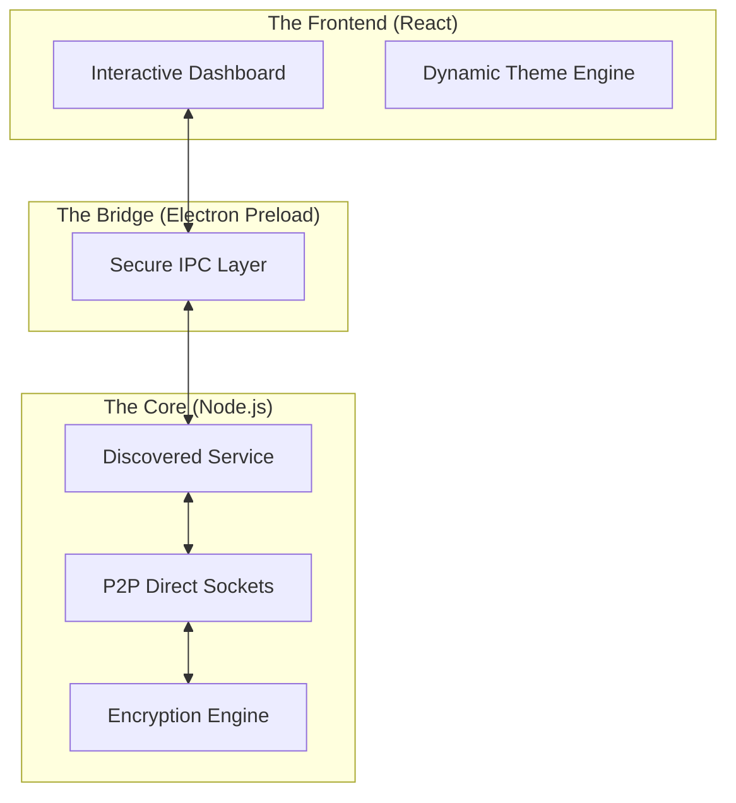

<div align="center">


# 🔗 Lost-Link
### **Secure • Decentralized • Zero-Config Offline Messaging**

[](https://reactjs.org/)
[](https://www.electronjs.org/)
[](https://tailwindcss.com/)
[](https://www.typescriptlang.org/)
[](https://vitejs.dev/)

---

**Lost-Link** is a production-ready, peer-to-peer messaging suite designed for seamless communication on local networks without internet dependencies.

[**Documentation**](docs/index.md) • [**Getting Started**](#-quick-start) • [**Architecture**](#-system-architecture) • [**Community**](https://twitter.com/Not_Shubham_111)

</div>

---

## 👨‍💻 Created by Shubham Kambli

<div align="center">

### **Founder of COSMIC • AI Engineer • Open-Source Builder**
*19-year-old Founder of COSMIC, AI engineer, and open-source builder creating production-ready tools at the intersection of artificial intelligence and software engineering.*

[](https://notshubham111.dev)
[](mailto:shubhamkambli1112@gmail.com)
[](https://linkedin.com/in/shubham-kambli-720650339)
[](https://twitter.com/Not_Shubham_111)
[](https://discord.gg/XA3ctdYZ)
[](https://reddit.com/u/Not_Shubham_111)

[📖 View Full Portfolio](https://portfolio.notshubham111.dev) • [🏠 Wiki Home](https://github.com/NotShubham111/Lost-Link/wiki)

</div>

---

## 🎯 Project Overview

### The Mission
In a world of constant connectivity, **Lost-Link** provides a secure, private, and resilient communication bridge for environments where the internet is a luxury or a security risk. Whether it's a remote research station, a secure office, or a local community event, Lost-Link ensures your words travel only as far as they need to.

### 💎 Key Features

| Feature | Aesthetic | Description |
|:---|:---:|:---|
| **📡 Peer Discovery** | `📶` | Instant, zero-config detection of users on your subnet using UDP. |
| **🔒 E2EE Security** | `🔐` | Hardened privacy with ECDH key exchange and AES-GCM 256-bit encryption. |
| **⚡ High Performance** | `🚀` | Ultra-responsive UI powered by Electron-Vite and React concurrency. |
| **🛡️ Privacy First** | `👤` | Zero telemetry. Zero cloud. Zero tracking. Just pure decentralized chat. |
| **🎨 Premium Design** | `✨` | Glassmorphic UI with smooth animations and intuitive navigation. |

---

## 🏗️ System Architecture

Lost-Link's engine is built on a custom P2P stack that bridges human interaction with robust network protocols.



---

## 📂 Repository Structure

```bash
lost-link/
├── 📁 assets/                # README visual resources & branding
├── 📁 src/                   # Main Application Source
│   ├── 📁 main/             # Electron Main Process Logic
│   ├── 📁 preload/          # Security-hardened IPC Bridges
│   └── 📁 renderer/         # React Frontend Core
├── 📁 resources/             # Build icons and static assets
├── 📁 legacy_src/            # Prototype archival scripts
└── package.json              # Project manifests & dependencies
```

---

## 🚀 Quick Start

### 1️⃣ Installation
```bash
# Clone the vision
git clone https://github.com/NotShubham111/Lost-Link.git && cd lost-link

# Install the engine
npm install
```

### 2️⃣ Running Locally
```bash
# Launch development environment
npm run dev
```

### 3️⃣ Packaging
```bash
# Build production executables
npm run build
```

> [!IMPORTANT]
> **Firewall Configuration:** Ensure your local network allows **UDP Broadcasts** on port 5000 (default) for peer discovery to function correctly.

---

## 📄 License
Licensed under the **MIT License**. Build, modify, and share freely!

---
